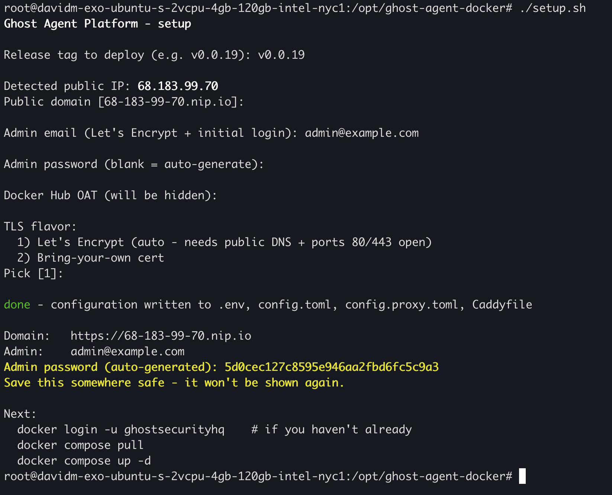

# ghost-agent-docker

Self-hosted deployment of the Ghost Agent Platform via `docker compose`.

The stack runs the gateway, credential proxy, worker fleet, in-stack
updater, MongoDB, and a Caddy reverse proxy as docker containers on
a single host.

## Example deployment

A working install from a stock Ubuntu image (no Docker preinstalled):

- **VM**: 4 GB / 2 Intel vCPUs / 120 GB / Ubuntu 24.04 (LTS) x64
- **Install path**: `/opt/ghost-agent-docker`

Bootstrap once:

```bash
apt-get update
apt-get install -y docker.io docker-compose-v2
git clone https://github.com/ghostsecurity/ghost-agent-docker.git /opt/ghost-agent-docker
cd /opt/ghost-agent-docker
```

Then follow the **Install** section below: `docker login`, then
`./setup.sh`, then `docker compose pull && up -d`.



(not including output from follow-up steps under `Next:`)

## Prerequisites

- Linux host with a public IPv4, SSH access, and `docker` (Engine
  24+) + the `docker compose` v2 plugin installed.
- A Docker Hub access token (issued by Ghost during onboarding).
- Outbound HTTPS access to `docker.io` (and its Cloudflare-backed
  CDN at `production.cloudflare.docker.com`) for image pulls.
- TLS, one of:
  - **Automatic Let's Encrypt** (most common): ports 80/443
    reachable from the internet. No domain required - the install
    defaults to `<dashed-public-ip>.nip.io` (e.g.
    `203-0-113-45.nip.io`), which resolves any dashed-IP subdomain
    to that IP and is a fine public hostname as far as Let's
    Encrypt is concerned.
  - **Bring your own cert**: an existing TLS cert + private key
    plus DNS pointing at this host. Required when DNS is private,
    the host can't accept inbound traffic from the LE servers, or
    your org uses an internal CA.

## Install

### 1. Clone this repo on the host

```bash
git clone https://github.com/ghostsecurity/ghost-agent-docker.git
cd ghost-agent-docker
```

### 2. Authenticate to Docker Hub

Run as the same user that will run `docker compose`:

```bash
docker login -u ghostsecurityhq
# paste the OAT when prompted
```

This authenticates the host's docker CLI so the initial
`docker compose pull` (step 4) succeeds. The in-stack updater
authenticates itself separately at container start using the OAT
in `.env` - no host filesystem dependency. The host login is only
needed for the initial pull and for any manual `docker compose
pull`/`up -d` runs you perform from the shell later.

### 3. Create the runtime config

Run the interactive script:

```bash
./setup.sh
```

It prompts for the per-deployment inputs (release tag, public
domain - auto-detected as `nip.io`, admin email + password, Docker
Hub OAT, TLS flavor), auto-generates `ENCRYPTION_KEY` and
`jwt_secret`, and writes `.env`, `config.toml`, `config.proxy.toml`,
and `Caddyfile` from their `.example` templates. Refuses to
overwrite existing files - delete them and re-run to regenerate.

Or, to edit by hand: copy each `*.example` to its target name,
open the four files, replace every empty REQUIRED value and `TODO`
comment. Inline comments document each one. For BYO-cert, also
`mkdir -p certs/` and place `fullchain.pem` + `privkey.pem` there.

### 4. Pull and start

```bash
docker compose pull
docker compose up -d
```

The first `up` takes a minute or two: MongoDB initializes its
replica set, the credential proxy generates its CA, the UI bundle
is copied into the shared volume, and Caddy provisions a cert (LE
flavor only).

### 5. Verify

```bash
docker compose ps
```

All services should be `running` (with `database` showing healthy).
Open `https://<your-domain>` in a browser. Log in with the seed
admin credentials from step 3 and rotate the password from the UI.

## Upgrade

The in-stack updater polls Docker Hub every 10 minutes for new
release tags. When a newer `vX.Y.Z` is available, the "Upgrade"
button in the UI's System view lights up. Click it to upgrade the
running stack in place.

To upgrade out of band (or to bump the updater image itself, which
the in-UI upgrade deliberately doesn't touch):

```bash
sed -i 's/^TAG=.*/TAG=vX.Y.Z/' .env
docker compose pull
docker compose up -d
```

## Common adjustments

| Goal | Where |
| --- | --- |
| Scale worker replicas | `WORKER_REPLICAS` in `.env`, then `docker compose up -d worker` |
| Bump the updater image only | `UPDATER_TAG` in `.env`, then `docker compose up -d exo-updater` |
| Run behind an existing reverse proxy | Keep Caddy in the stack (it serves the static UI bundle as well as proxying the API). Switch its Caddyfile to plain HTTP on a different host port, then point your external proxy at that port |
| Use named volumes on a specific disk | Override the volume definitions at the bottom of `docker-compose.yml` with `driver_opts` pointing at the desired filesystem |
| Switch the registry | `REGISTRY` in `.env` (must mirror the `ghostsecurityhq/exo-*` layout) |
| Cap container log size + auto-prune old images | Optional final step in `setup.sh`. Caps each container's logs at 10MB x 3 rotation (`json-file` driver), installs a daily systemd timer running `docker image prune -a --filter until=168h`. Answer 'n' at the prompt to skip |

## Logs

```bash
docker compose logs -f --tail=100 gateway
docker compose logs -f --tail=100 credential-proxy
docker compose logs -f --tail=100 exo-updater
docker compose logs -f --tail=100 worker
```

## Tearing down

```bash
docker compose down            # stop containers, keep volumes
docker compose down -v         # also delete volumes (DESTRUCTIVE)
```

`down -v` removes the MongoDB data volume, Caddy's cert state, the
credential proxy's CA material, and all runner identities. Treat it
like dropping a database - everything has to be reseeded/recreated after.
